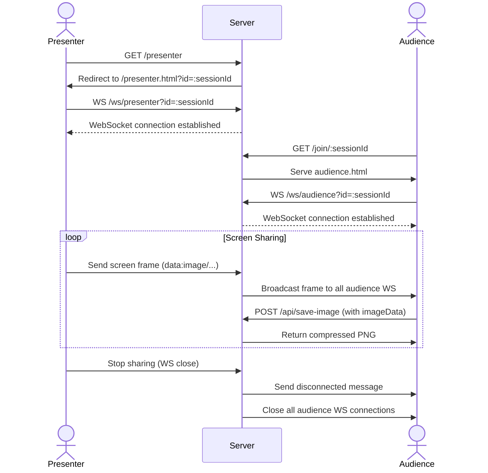

# ATTENZIONE PicPocket!!!

Viewing [IRL](https://dictionary.cambridge.org/dictionary/english/irl) presentations shouldn't be a hassle.  

From venues with tiny screens to sitting too far back at church, PicPocket makes things clearer *(for good)*.

  

## Usage

Access PicPocket live at [picpocket.onrender.com](https://picpocket.onrender.com/).

## Architecture 

## Nerd details

...

## Contributors

<table>
	<tbody>
        <tr>
            <td align="center">
                <a href="https://www.linkedin.com/in/gabriel-zmong/">
                    
                     
                    <b>Gabriel Ong</b>
                </a>
                 
            </td>
            <td align="center">
                <a href="https://www.linkedin.com/in/samuelrawrs/">
                    
                     
                    <b>Samuel Ang</b>
                </a>
                 
            </td>
        </tr>
	</tbody>
</table>
