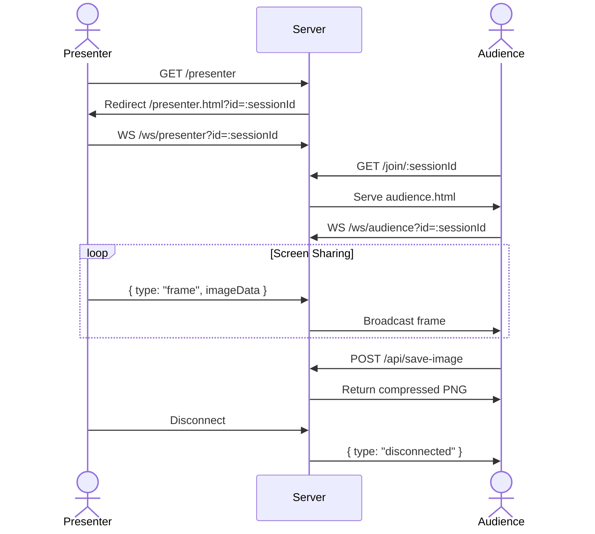

# PicPocket

PicPocket makes in-person presentations easier to see. A presenter shares their
screen once, audience members join with a QR code or link, and the current slide
appears live on each audience device.

<div align="center">
  
</div>

## Live App

PicPocket is deployed at [picpocket.onrender.com](https://picpocket.onrender.com/).

## Features

- Presenter sessions with readable two-word IDs.
- QR code and copyable audience join link.
- Live frame relay over WebSockets.
- Late audience joiners receive the latest frame.
- Audience zoom, pan, share-link, and save controls.
- Server-side PNG save fallback using Sharp.
- Health check, automated tests, linting, formatting, and CI.

## Local Development

```bash
npm ci
npm start
```

Open `http://localhost:3000/presenter` to start a presentation.

Useful commands:

```bash
npm run lint
npm run format:check
npm test
npm run test:e2e
npm run audit
```

For Playwright smoke tests, install a browser first:

```bash
npx playwright install chromium
```

## Configuration

Copy `.env.example` if you need local overrides.

| Variable                   | Default   | Purpose                                     |
| -------------------------- | --------- | ------------------------------------------- |
| `PORT`                     | `3000`    | HTTP port                                   |
| `DEBUG`                    | `false`   | Enables debug logs                          |
| `JSON_BODY_LIMIT`          | `10mb`    | Max JSON request body size                  |
| `MAX_AUDIENCE_PER_SESSION` | `250`     | Audience WebSocket cap per session          |
| `SESSION_TTL_MS`           | `7200000` | Session lifetime for newly created sessions |
| `WS_MAX_PAYLOAD_BYTES`     | `6291456` | Max WebSocket message size                  |

## Architecture


```mermaid
sequenceDiagram
    actor Presenter as Presenter
    participant Server
    actor Audience as Audience

    Presenter->>Server: GET /presenter
    Server->>Presenter: Redirect /presenter.html?id=:sessionId
    Presenter->>Server: WS /ws/presenter?id=:sessionId

    Audience->>Server: GET /join/:sessionId
    Server->>Audience: Serve audience.html
    Audience->>Server: WS /ws/audience?id=:sessionId

    loop Screen Sharing
        Presenter->>Server: { type: "frame", imageData }
        Server->>Audience: Broadcast frame
    end

    Audience->>Server: POST /api/save-image
    Server->>Audience: Return compressed PNG

    Presenter->>Server: Disconnect
    Server->>Audience: { type: "disconnected" }
```

The server is intentionally small:

- `server.js` wires the HTTP server and WebSocket server.
- `src/app.js` owns Express routes and static assets.
- `src/websocket.js` owns session WebSocket behavior.
- `src/sessionStore.js` owns in-memory session state.
- `src/imageService.js` owns image parsing/compression.
- `public/js` owns presenter and audience browser behavior.

## API Surface

HTTP:

- `GET /`
- `GET /presenter`
- `GET /join/:sessionId`
- `GET /healthz`
- `GET /api/qrcode?data=:url`
- `POST /api/save-image`

WebSocket:

- `/ws/presenter?id=:sessionId`
- `/ws/audience?id=:sessionId`

Presenter messages:

```json
{
  "type": "frame",
  "imageData": "data:image/jpeg;base64,...",
  "sentAt": 1234567890
}
```

```json
{ "type": "awaiting" }
```

Server lifecycle message:

```json
{
  "type": "disconnected",
  "message": "Presenter disconnected. Presentation ended."
}
```

## Production Notes

Sessions are stored in memory. That keeps the app simple and works for a
single-instance deployment, but multi-instance hosting needs sticky sessions or
a shared relay such as Redis pub/sub.

Screen frames are sent as compressed image data URLs. This is simple and
portable, but it is not a replacement for WebRTC when low-latency video-scale
streaming is required.

## Contributors

<table>
  <tbody>
    <tr>
      <td align="center">
        <a href="https://www.linkedin.com/in/gabriel-zmong/">
          
          <br />
          <sub><b>Gabriel Ong</b></sub>
        </a>
      </td>
      <td align="center">
        <a href="https://www.linkedin.com/in/samuelrawrs/">
          
          <br />
          <sub><b>Samuel Ang</b></sub>
        </a>
      </td>
    </tr>
  </tbody>
</table>
