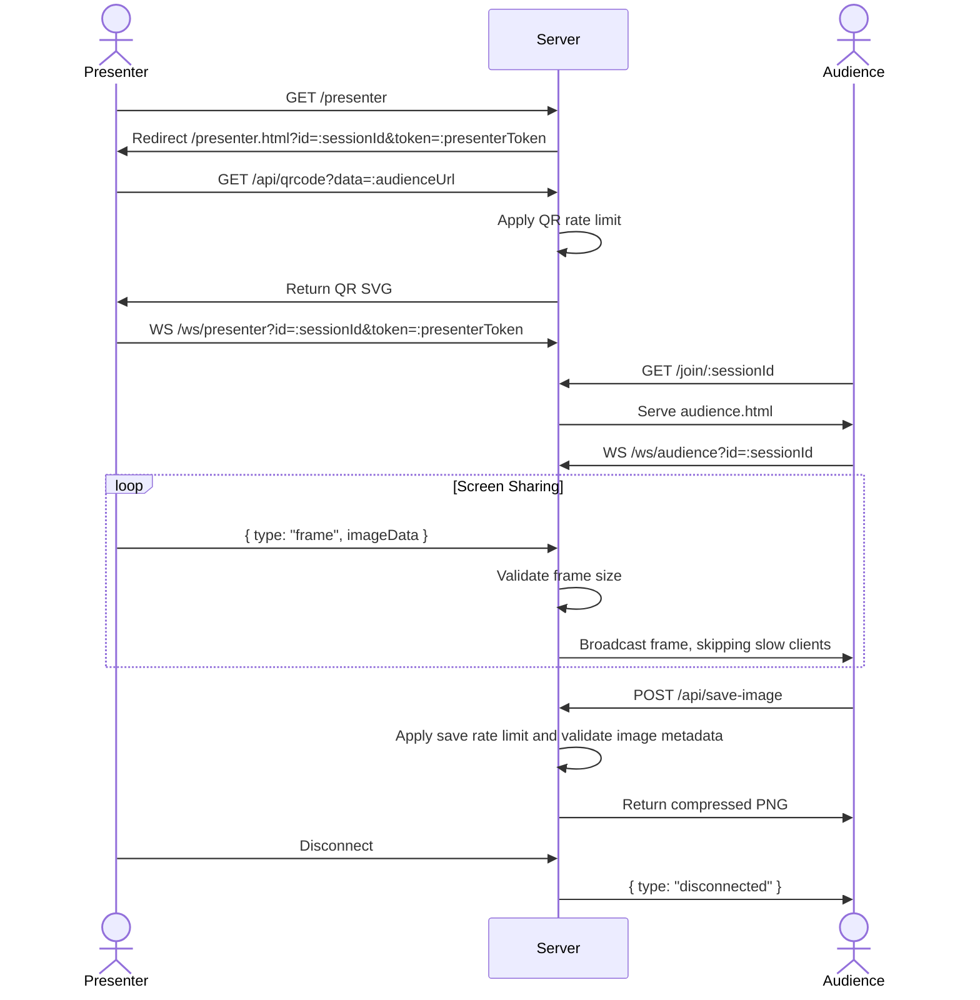

[](https://github.com/gongahkia/tanabata/releases/tag/1.0.0)


# `PicPocket`

[Share Screen](https://support.zoom.com/hc/en/article?id=zm_kb&sysparm_article=KB0060596) for [IRL](https://dictionary.cambridge.org/dictionary/english/irl) presentations.

<div align="center">
  
</div>

## What does PicPocket do?

A presenter shares their screen once, audience members join with a QR code or link, and the current slide appears live on each audience device.

## Features

- Presenter sessions with readable two-word IDs
- Cryptographic presenter tokens so audience links cannot publish frames
- QR code and copyable audience join link
- Live frame relay
- Late audience joiners receive the latest frame
- Audience zoom, pan and share-link
- Server-side PNG saves

## Architecture


```mermaid
sequenceDiagram
    actor Presenter as Presenter
    participant Server
    actor Audience as Audience

    Presenter->>Server: GET /presenter
    Server->>Presenter: Redirect /presenter.html?id=:sessionId&token=:presenterToken
    Presenter->>Server: GET /api/qrcode?data=:audienceUrl
    Server->>Server: Apply QR rate limit
    Server->>Presenter: Return QR SVG
    Presenter->>Server: WS /ws/presenter?id=:sessionId&token=:presenterToken

    Audience->>Server: GET /join/:sessionId
    Server->>Audience: Serve audience.html
    Audience->>Server: WS /ws/audience?id=:sessionId

    loop Screen Sharing
        Presenter->>Server: { type: "frame", imageData }
        Server->>Server: Validate frame size
        Server->>Audience: Broadcast frame, skipping slow clients
    end

    Audience->>Server: POST /api/save-image
    Server->>Server: Apply save rate limit and validate image metadata
    Server->>Audience: Return compressed PNG

    Presenter->>Server: Disconnect
    Server->>Audience: { type: "disconnected" }
```

## API Surface

### HTTP

- `GET /`
- `GET /presenter`
- `GET /join/:sessionId`
- `GET /healthz`
- `GET /api/qrcode?data=:url`
- `POST /api/save-image`

### WebSocket

- `/ws/presenter?id=:sessionId&token=:presenterToken`
- `/ws/audience?id=:sessionId`

### Presenter messages

```json
{
  "type": "frame",
  "imageData": "data:image/jpeg;base64,...",
  "sentAt": 1234567890
}
```

```json
{ "type": "awaiting" }
```

### Server lifecycle message

```json
{
  "type": "disconnected",
  "message": "Presenter disconnected. Presentation ended."
}
```

## Contributors

<table>
  <tbody>
    <tr>
      <td align="center">
        <a href="https://www.linkedin.com/in/gabriel-zmong/">
          
          <br />
          <sub><b>Gabriel Ong</b></sub>
        </a>
      </td>
      <td align="center">
        <a href="https://www.linkedin.com/in/samuelrawrs/">
          
          <br />
          <sub><b>Samuel Ang</b></sub>
        </a>
      </td>
    </tr>
  </tbody>
</table>
